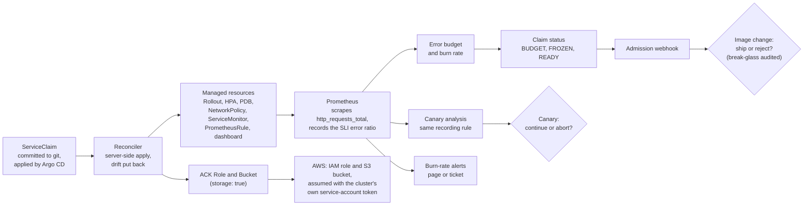
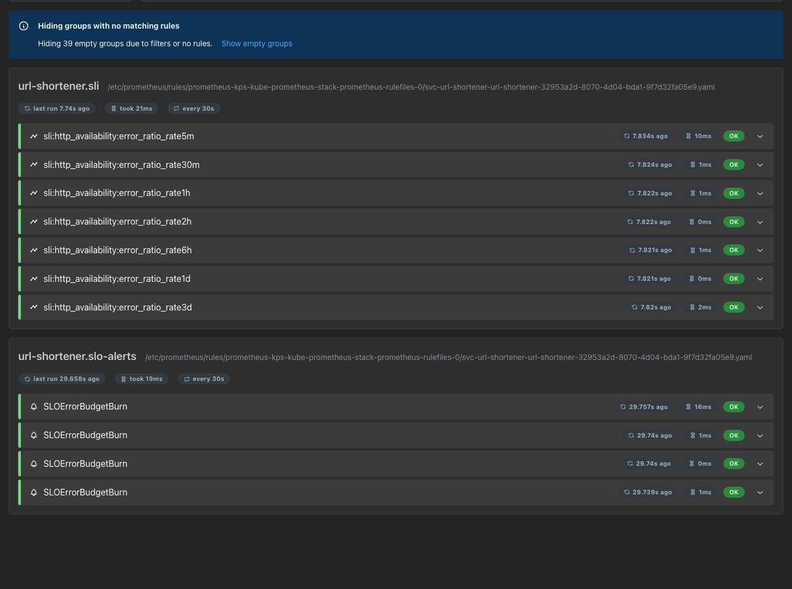
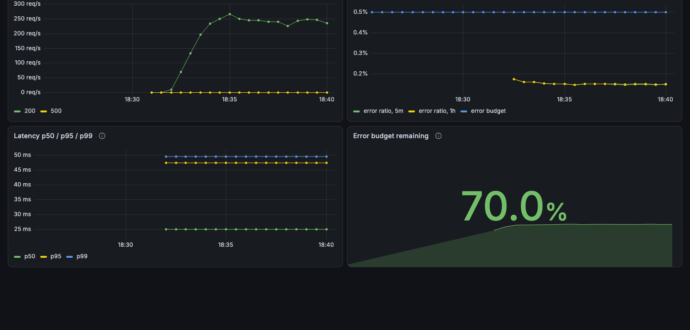
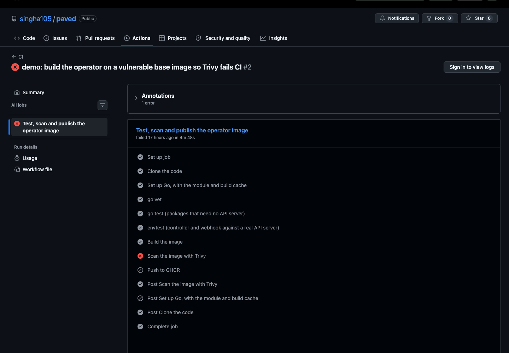
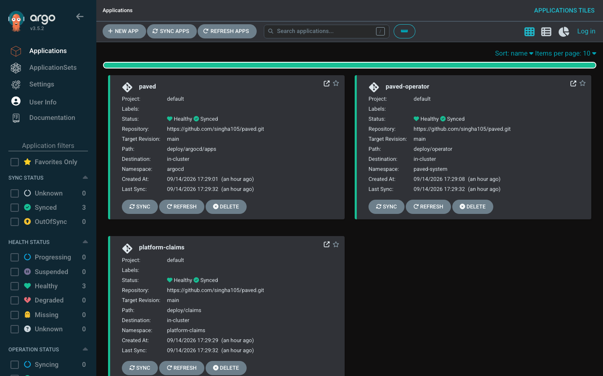

# paved

**Every team that ships a service to Kubernetes rebuilds the same production scaffolding by hand:
resource limits, probes, autoscaling, a disruption budget, network policy, SLO alerts, a dashboard, a
runbook, a canary. Each copy drifts, nobody measures whether the service is meeting its SLO, and
nothing stops a team from shipping into an outage it is already having.** paved is an internal
developer platform built as a Kubernetes operator. A team writes one short `ServiceClaim`; paved turns
it into all of that, keeps it that way, reads the service's error budget from Prometheus, freezes
deploys when the budget is gone, and aborts a bad release halfway through its canary. With one more
line, `storage: true`, it also gives the service an S3 bucket and an IAM role that only its own pods
can use, with no AWS key anywhere.

This is the whole of what a team wrote to onboard [`shortlink`](services/shortlink), a URL shortener
with its own code and image: 18 lines.

```yaml
apiVersion: platform.paved.dev/v1alpha1
kind: ServiceClaim
metadata:
  name: shortlink
  namespace: platform-claims
spec:
  owner: team-growth
  image: k3d-paved-registry:5001/shortlink:0.1.0
  port: 8080
  tier: internal
  sli:
    type: http-availability
  slo:
    objective: "99.9"
    window: 28d
  scale:
    min: 2
    max: 4
```

Committed to git, those lines became, in namespace `svc-shortlink`:

- **A Rollout** (Argo Rollouts) running the image as non-root, read-only, without capabilities, with
  fixed resources and probes, released as a canary: 20% of pods, 2 minutes, 50%, 2 minutes, 100%.
- **An AnalysisTemplate** that reads the service's error ratio every 30 seconds during a canary and
  aborts it above 5%.
- **A Service, a HorizontalPodAutoscaler** (2 to 4 replicas at 70% CPU) and **a PodDisruptionBudget**.
- **A NetworkPolicy** that admits only its own namespace, the platform and Prometheus.
- **A ServiceMonitor, and a PrometheusRule** with 7 SLI recording rules and 4 multi-window burn-rate
  alerts derived from the 99.9% objective.
- **A Grafana dashboard and a runbook**, as ConfigMaps.
- **A ServiceAccount, and the namespace itself**, which is deleted with the claim.
- **A status on the claim**: error budget remaining, 1h burn rate, whether deploys are frozen,
  whether it is ready. **A deploy policy**: image changes rejected while the budget is exhausted.

It was `Ready=True` 7 seconds after the claim file was created, with no ticket and no `kubectl apply`.

## Architecture



The error ratio Prometheus records for a claim has three jobs: it pages people when the budget burns
too fast, it freezes deploys when the budget is gone, and it aborts a canary that makes it worse.
Measurement is defined once, per service, so alerting, release policy and rollback can never disagree
about whether a service is healthy
([ADR-022](DECISIONS.md#adr-022-the-canary-is-gated-on-the-same-sli-recording-rule-as-the-alerts-and-the-freeze)).

## The demos

Each GIF links to its asciinema recording (`asciinema play demo/<name>.cast`). They were recorded
unattended from the scripts in [`demo/`](demo) on a local k3d cluster.

### 3. The error budget runs out, and deploys freeze

[](demo/03-freeze.cast)

Errors spend url-shortener's budget until the controller freezes its deploys. The next image bump is
rejected by the webhook, with the budget, window and burn rate in the message. An urgent hotfix goes
out with a break-glass reason and is recorded in a `BreakGlassUsed` Event. The errors stop, the budget
comes back past 5%, and the same bump ships. [`demo/freeze-demo.sh`](demo/freeze-demo.sh)

### 2. Drift is put back

[](demo/02-drift.cast)

Someone deletes a PrometheusRule paved manages. The controller notices through its watch, applies it
again, and records a `DriftCorrected` Event on the claim. [`demo/02-drift.sh`](demo/02-drift.sh)

### 1. A second service is onboarded with one file

[](demo/01-onboard.cast)

The claim above is created, committed and pushed. Argo CD applies it, paved builds the service, and
the claim reports `Ready=True`. The demo then lists what it became and follows a short link through
it. [`demo/onboard-demo.sh`](demo/onboard-demo.sh)

### 4. A bad release is aborted mid-canary

[](demo/04-canary.cast)

A release that fails every request goes out the normal way, as a commit. At its first pause, the
analysis reads an error ratio over 5% and Argo Rollouts aborts the canary with nobody touching the
cluster; the stable version never stops serving. Reverting the commit brings git back in line.
[`demo/canary-demo.sh`](demo/canary-demo.sh)

### 5. A claim gets storage, with no AWS key anywhere

[](demo/05-storage.cast)

Two teams add `storage: true` to their claims:
- **ACK creates the AWS side.** It makes an IAM role and an S3 bucket for each claim, and both
  claims are Ready 16 seconds later.
- **Each pod reaches only its own bucket.** A pod runs as one claim's service account, with exactly
  the identity paved put in that claim's Rollout. It writes and reads its own bucket, and AWS
  refuses it the other claim's.
- **No key is stored.** A scan of every Secret, ConfigMap and pod in the cluster finds no AWS key.
- **Data outlives the claim.** Deleting a claim removes its role; its bucket, and the data in it,
  stays.

The AWS account ID is redacted from the recording. The demo is optional, since it needs an AWS
account ([quickstart](#storage-on-aws-optional)). [`demo/05-storage.sh`](demo/05-storage.sh)

## Measured results

Every number here was measured on this project's local k3d cluster (k3s v1.36.4 on Docker Desktop,
Apple silicon); how each was taken is recorded in [PROGRESS.md](PROGRESS.md).

| What | Result | How it was measured |
|---|---|---|
| Onboarding a second service | **7 s** from creating the claim file to `Ready=True` | `demo/onboard-demo.sh`: the file's creation to the claim's `Ready` transition. Its image was already built and pushed (24 s); typing the claim by hand is not included. |
| YAML the team wrote | **18 lines** | Non-blank, non-comment lines of `deploy/claims/shortlink.yaml` |
| Drift restore | **median 188 ms** (100 to 257 ms over 5 runs) | A deleted PrometheusRule: from `kubectl delete` returning to the watch's `ADDED` event, controller running in the cluster |
| Storage for a claim | **16 s** from applying the claim to `StorageReady=True` and `Ready=True` | `demo/05-storage.sh` in the recording: the clock when the claims were applied, to the conditions' `lastTransitionTime`. The role was created, and the bucket, kept from an earlier run, adopted. |
| A deleted claim's role | **Gone 49 s** after `kubectl delete`; IAM then answers `NoSuchEntity` | The same recording: the claim and its namespace gone, then `aws iam get-role`. The bucket is still there. |
| AWS keys in the cluster | **0** in 26 Secrets, 76 ConfigMaps and 32 pods | The recording's scan: Secret values and Helm releases decoded, key IDs matched case-sensitively |
| Canary abort | **62 s, 63 s, 63 s** (median 63 s) | From paved applying the bad image to the Rollout to the Rollout's `abortedAt`, in the recording and two more runs |
| Reconcile p95 | **494 ms** (median 192 ms) | `controller_runtime_reconcile_time_seconds` on the in-cluster controller: 95 reconciles over 10 minutes, covering three claims' one-minute refreshes, shortlink's onboarding and five drift restores; interpolated inside the 450 to 500 ms bucket |
| Tests | **123**, all passing | `go test -v`: 92 Go tests (87 in the operator module, envtest included and the Kind e2e suite excluded, and 5 in `services/shortlink`) and 31 Ginkgo specs (11 controller, 12 webhook, and the 8 in `test/`) |

## What you cannot configure, and why

A claim has fields for what a team knows best: who owns the service, what it runs, how it is
measured, what it promises and how far it scales. Everything else is the golden path, the same for
every service, and not in the API at all
([ADR-001](DECISIONS.md#adr-001-developers-cannot-set-limits-security-context-rollout-strategy-probes-or-canary-steps)).

| You can't set | paved decides | Why |
|---|---|---|
| CPU and memory | Requests 50m and 64Mi, limits 250m and 128Mi | Capacity and cost stay predictable, and one noisy service can't starve its neighbours. A service that needs more is a platform change, made once. |
| Security context | UID 65532, read-only root filesystem, no capabilities, `RuntimeDefault` seccomp | Every service gets the same baseline. An exception would be reviewed once, not rediscovered in each manifest. |
| Probes | `/readyz` for readiness, `/healthz` for liveness, on the claim's port | Canaries, the PDB and the Service all trust readiness, so it has to mean the same thing everywhere. |
| Rollout strategy and canary steps | Canary, 20%, 2 min, 50%, 2 min, 100% | The analysis needs pauses long enough to see a bad release before it is promoted ([ADR-022](DECISIONS.md#adr-022-the-canary-is-gated-on-the-same-sli-recording-rule-as-the-alerts-and-the-freeze)). |
| Canary abort threshold | A 5m error ratio above 5% | One definition of "broken", shared with alerting and the freeze. |
| Alert thresholds | Four burn-rate alerts: 14.4x and 6x page, 3x and 1x ticket | Paging means the same thing for every team; the thresholds come from the objective, not taste. |
| Replica floor, autoscaling, disruption | Public runs at least 2 replicas; HPA at 70% CPU; at most one pod down at a time | An availability baseline per tier ([ADR-008](DECISIONS.md#adr-008-the-hpa-owns-the-replica-count-and-tier-floors-never-produce-an-invalid-object)). |
| Network policy | Ingress only from its own namespace, the platform and Prometheus, plus Traefik for public | Nothing is reachable by accident, and nothing can widen it by accident ([ADR-007](DECISIONS.md#adr-007-networkpolicy-lets-prometheus-in-and-leaves-egress-open)). |
| Namespace | `svc-<name>`, deleted with the claim | Everything a claim owns is in one place and goes when the claim goes ([ADR-006](DECISIONS.md#adr-006-managed-objects-are-tied-to-their-claim-by-labels-and-a-finalizer-not-owner-references)). |
| Deploy freeze | Freeze at 0% budget, unfreeze at 5%, break-glass per change | Shipping into an outage stops, without trapping the fix ([ADR-017](DECISIONS.md#adr-017-deploys-freeze-when-the-budget-is-gone-and-unfreeze-only-at-5), [ADR-018](DECISIONS.md#adr-018-the-webhook-rejects-only-image-changes-and-break-glass-must-be-set-in-the-same-update)). |

What a claim does have: `owner`, `image`, `port`, `tier` (public, internal or batch), `sli.type`
(`http-availability`, with `goodStatuses`, or `http-latency`, with `latencyThreshold`),
`slo.objective` and `slo.window`, `scale.min` and `scale.max`, and `storage`, which can't change once
the claim exists.

## The service contract

The platform measures every service the same way, so every service must expose the same metrics.
**This is the one thing a service must do to be onboarded.** Serve Prometheus metrics at `/metrics` on
the claim's `port`:

- **`http_requests_total`**: a counter of HTTP requests with the status code in a label named `code`.
  For `http-availability`, a request is bad when its code is not in `sli.goodStatuses` (by default
  200, 201, 204, 301, 302, 304, 400 and 404).
- **`http_request_duration_seconds`**: a histogram of latency in seconds, for `http-latency`, with a
  bucket at exactly the claim's `sli.latencyThreshold` (250ms by default).
- **Create the series for every status code you return, at zero, before serving.** Prometheus's
  `rate()` can't see the increase that creates a series, so otherwise the first failures after every
  start never count. That bug is the subject of [POSTMORTEM.md](POSTMORTEM.md).
- **Count only application requests,** not probes or scrapes, and serve `/healthz` and `/readyz` on
  the same port. The container runs as UID 65532 with a read-only root filesystem.

**A claim with `storage: true` needs nothing more from the service.** Its pods get
`PAVED_STORAGE_BUCKET`, `AWS_REGION`, `AWS_ROLE_ARN`, and `AWS_WEB_IDENTITY_TOKEN_FILE` pointing at a
token only AWS STS accepts. Any AWS SDK's default credentials assume the claim's role from these,
with no key to configure.

Go services get the metrics from `prometheus/client_golang`'s `promhttp.InstrumentHandlerCounter` and
`InstrumentHandlerDuration`; [`services/shortlink`](services/shortlink) is a complete example with a
test that fails if a series is missing.

## Quickstart

Requires Docker, [k3d](https://k3d.io), kubectl, Helm and curl. The demos also need ApacheBench (`ab`)
and the [`kubectl argo rollouts`](https://github.com/argoproj/argo-rollouts/releases/tag/v1.10.0)
plugin. Versions used are pinned in [PROGRESS.md](PROGRESS.md).

```bash
git clone https://github.com/singha105/paved.git
cd paved
make demo
```

`make demo` creates a k3d cluster and a local registry, installs cert-manager, Traefik, Argo Rollouts,
kube-prometheus-stack and Argo CD, pushes the images the example claims run, and hands the platform to
Argo CD, which deploys the operator image CI published and the claims in
[`deploy/claims`](deploy/claims). It returns when every claim is Ready. Verified from a clean clone on the Mac this was built on: with the cluster and its registry deleted first, `make demo` finished in **210 seconds**. Docker's build cache and Helm's chart cache were warm; every image inside the cluster was pulled fresh. A claim can show `READY False` for a few seconds after it returns, while its autoscaler adds a second pod.

Then run any demo, for example `./demo/02-drift.sh` or `./demo/freeze-demo.sh`. The canary and
onboarding demos commit and push to `main`, so run them from your own fork. To remove everything:

```bash
k3d cluster delete paved && k3d registry delete k3d-paved-registry
```

### Storage on AWS (optional)

Claims with `storage: true` need the cluster linked to an AWS account. It also needs the AWS CLI and
Terraform. Log in with a short-lived session, not an access key: `hack/aws-up.sh` refuses a profile
that stores one.

```bash
aws login --profile paved
```

```bash
PAVED_AWS_PROFILE=paved make demo
```

This creates the AWS side with Terraform ([`infra/aws`](infra/aws)):
- a bucket that publishes only the cluster's OIDC discovery document and signing keys
- an IAM OIDC provider that trusts them
- a permissions boundary for claims' roles
- one scoped role for each ACK controller

It then creates the cluster with that public issuer, and installs the ACK IAM and S3 controllers.
Linked to the author's account it took **253 seconds**, with the cluster deleted first and the
registry kept. Then run `PAVED_AWS_PROFILE=paved ./demo/05-storage.sh`.

To remove the AWS side:
1. Delete every claim with storage. Their roles go with them.
2. Run `PAVED_AWS_PROFILE=paved make aws-down`. Terraform asks before it deletes anything.

Buckets are kept by design, and yours to empty and delete.

## How it works

- **Reconcile.** The controller server-side applies every object a claim's tier needs with one field
  owner, and compares that owner's field set before and after to tell a drift correction from a no-op
  ([ADR-002](DECISIONS.md#adr-002-server-side-apply-with-one-field-owner-for-everything-the-controller-writes),
  [ADR-015](DECISIONS.md#adr-015-drift-is-detected-from-the-controllers-own-field-ownership)). Children
  live in another namespace, so they are tied to the claim with labels and a finalizer rather than
  owner references.
- **Measure.** Every minute it reads the claim's error ratio over its SLO window and the last hour,
  and records the budget and burn rate. If Prometheus can't answer, it fails open: `SLOHealthy` is
  `Unknown`, nothing is guessed, and resources are still reconciled
  ([ADR-014](DECISIONS.md#adr-014-when-prometheus-cant-answer-the-controller-fails-open)).

  

  *The rules generated from url-shortener's claim, loaded and healthy in Prometheus.*

  

  *url-shortener's generated dashboard after 8 minutes of test traffic with 0.15% errors, against a 0.5% error budget.*

- **Decide.** `DeploysFrozen` is set with hysteresis, and a validating webhook rejects image changes
  while it is `True`, unless the change carries a new break-glass reason. `Ready` means every resource
  is applied and the Rollout is healthy at its current generation.
- **Deliver.** CI tests the operator, builds its image and fails on fixable HIGH or CRITICAL
  vulnerabilities before pushing to GHCR; the
  [`demo/trivy-catch`](https://github.com/singha105/paved/tree/demo/trivy-catch) branch shows the
  [scan failing a build](https://github.com/singha105/paved/actions/runs/34807296384). Argo CD applies
  the operator and every claim from git
  ([ADR-021](DECISIONS.md#adr-021-ci-scans-the-operator-image-before-anything-can-publish-it),
  [ADR-023](DECISIONS.md#adr-023-argo-cd-delivers-the-operator-and-the-claims-from-git-as-an-app-of-apps)).

  

  *CI on the `demo/trivy-catch` branch: the scan fails, so the vulnerable image is never pushed.*

  

  *The app-of-apps in Argo CD: the root app, and the operator and claims apps it creates, each synced from `main`.*

- **Storage.** A claim with `storage: true` gets an ACK `Role` and `Bucket`, applied like everything
  else. The role trusts only that claim's service account and is capped by a permissions boundary.
  Its pods assume it with a projected token that AWS verifies against the cluster's public issuer,
  so no key exists to leak or rotate. Deleting the claim removes the role and keeps the bucket
  ([ADR-025](DECISIONS.md#adr-025-claims-get-storage-through-the-clusters-own-identity-with-no-aws-key-anywhere)).
- **Why an operator at all.** A Helm chart renders once; paved keeps objects as declared, reports
  status, and makes deploy decisions from live data
  ([ADR-024](DECISIONS.md#adr-024-paved-is-an-operator-not-a-helm-chart)).

## Repository layout

```
api/v1alpha1/        ServiceClaim types
cmd/main.go          controller manager
internal/builders/   one pure function per managed object
internal/slo/        error budgets, recording rules, burn-rate alerts
internal/controller/ reconciler: resources, drift, error budget, deploy freeze, Ready
internal/webhook/    admission webhook: rejects image changes during a freeze, audits break-glass
test/                envtest suite (eight specs), e2e suite, third-party CRDs for tests
deploy/              what Argo CD applies: the app-of-apps, the operator overlay, the claims
services/shortlink/  the second service: a URL shortener in its own module
examples/testsvc/    the test service behind url-shortener and webhook-delivery
demo/                demo scripts and their asciinema recordings
docs/                runbooks the alerts link to, the demo GIFs and the screenshots
system-design/       high-level design (HLD.md) and low-level design (LLD.md)
hack/                cluster bootstrap, make demo, image scripts
infra/aws/           Terraform for the optional AWS link: public issuer, OIDC provider, boundary, ACK roles
```

**Read next:** [system-design/HLD.md](system-design/HLD.md) for the high-level design,
[system-design/LLD.md](system-design/LLD.md) for the low-level design, [DECISIONS.md](DECISIONS.md) for why each piece is the way it is,
[POSTMORTEM.md](POSTMORTEM.md) for the worst bug of the week, and [PROGRESS.md](PROGRESS.md) for the
day-by-day build with the output that proves each step.

## License

Apache License 2.0.
