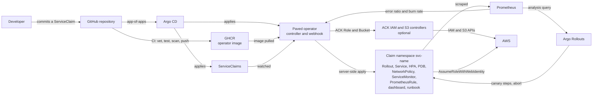

# Paved: high-level design

This document describes what Paved is made of and how the parts work together. The
[low-level design](LLD.md) covers each part in detail, [DECISIONS.md](../DECISIONS.md) explains why
each choice was made, and [PROGRESS.md](../PROGRESS.md) holds the output that proves each step. Every
number here was measured on this project's local cluster; none is an estimate.

## 1. Problem and purpose

Every team that ships a service to Kubernetes rebuilds the same production scaffolding by hand:
- resource limits, probes and security settings
- autoscaling and a disruption budget
- network policy
- SLO alerts, a dashboard and a runbook
- a canary release

Each copy drifts from the others. Nobody measures whether the service meets its SLO, and nothing
stops a team from shipping while it is already in an outage.

Paved is an internal developer platform built as a Kubernetes operator. A team writes one short
`ServiceClaim`, and Paved:
- turns it into all of that scaffolding, and keeps it that way
- reads the service's error budget from Prometheus
- freezes deploys when the budget is gone
- aborts a bad release partway through its canary

Optionally, it also gives the service an S3 bucket and an IAM role that only its pods can use, with
no AWS key anywhere.

## 2. Goals and non-goals

### Goals

1. **A controller, not a generator.** Paved reconciles continuously: it puts back changed or deleted
   objects and reports what it sees in the claim's status.
2. **SLOs drive deploy policy.** Error budgets and burn rates come from live Prometheus data. An
   admission webhook rejects image changes while a claim's budget is exhausted, with an audited
   break-glass override.
3. **Proven on a second service.** An unrelated service, `shortlink`, was onboarded through the same
   path, with 18 lines of YAML.
4. **Keyless storage (optional).** A claim with `storage: true` gets AWS storage through the cluster's
   own identity, without any stored credential.

### Non-goals

- **Configurability of the golden path.** Limits, probes, security context, rollout strategy and
  canary steps aren't fields in the API ([ADR-001](../DECISIONS.md#adr-001-developers-cannot-set-limits-security-context-rollout-strategy-probes-or-canary-steps)).
- **Replacing CI or GitOps.** Paved consumes a GitHub Actions pipeline and Argo CD; it doesn't build
  images or sync git itself.
- **Multi-cluster operation.** One cluster, which is a local k3d cluster in this project.
- **TLS for public ingress.** Public claims are served over plain HTTP on `<name>.localhost`.
- **Scraping batch workloads.** A batch claim gets a ServiceMonitor, but it has no Service for it to
  match.
- **Removing objects a claim stops producing.** Paved applies what a claim needs and deletes the whole
  namespace with the claim, but doesn't prune individual objects. This is why `spec.storage` is fixed
  at creation.

## 3. System context

The people involved:
- **Service teams** write claims, commit them, and read their status.
- **The platform team** owns Paved, the golden path encoded in it, and the stack it runs on.

## 4. Building blocks

| Component | Responsibility | Runs in | Source |
|---|---|---|---|
| `ServiceClaim` API | The only interface a team uses: owner, image, port, tier, SLI, SLO, scale, storage. Status reports conditions, budget, burn rate and storage. | CRD `platform.paved.dev/v1alpha1` | `api/v1alpha1` |
| Controller | Reconciles each claim into its namespace with server-side apply, detects drift, evaluates the SLO, decides the freeze, checks storage, reports `Ready` | `paved-system`, one active replica (leader election) | `internal/controller`, `cmd/main.go` |
| Builders | Pure functions from a claim to the Kubernetes objects its tier needs | Linked into the controller | `internal/builders` |
| SLO engine | Error budget and burn-rate maths, recording rules, burn-rate alerts, Prometheus client | Linked into the controller | `internal/slo` |
| Admission webhook | Rejects image changes to a frozen claim unless a new break-glass reason is set, and records an Event when break-glass is used | Same binary and pod as the controller | `internal/webhook/v1alpha1` |
| Argo Rollouts | Runs each claim's canary and its SLI analysis, and aborts a failing canary | `argo-rollouts` | Helm chart 2.43.1 |
| kube-prometheus-stack | Prometheus scrapes services and evaluates Paved's rules; Alertmanager receives the alerts; Grafana loads each claim's dashboard | `monitoring` | Helm chart 90.1.2 |
| cert-manager | Issues the webhook's serving certificate and injects its CA | `cert-manager` | Helm chart v1.21.2 |
| Traefik | Ingress for public claims | `traefik` | Helm chart 41.5.0 |
| Argo CD | Delivers the operator and the claims from git as an app-of-apps | `argocd` | Helm chart 10.9.0 (Argo CD v3.5.2) |
| CI | vet, unit tests, envtest, image build, Trivy scan, push to GHCR from `main`; lint and a Kind e2e suite | GitHub Actions | `.github/workflows` |
| ACK controllers (optional) | Create and correct each claim's IAM role and S3 bucket in AWS | `ack-system` | iam-controller 1.9.0, s3-controller 1.12.1 |
| AWS link (optional) | Public issuer documents, IAM OIDC provider, permissions boundary, scoped roles for the ACK controllers | AWS, eu-west-2 | `infra/aws` (Terraform) |

## 5. Deployment view

Everything runs on one k3d cluster (k3s v1.36.4), created by `make demo` (`hack/demo-up.sh`, which
calls `hack/cluster-up.sh`).

| Namespace | Contents |
|---|---|
| `paved-system` | The operator Deployment, its webhook Service and certificate, and the optional `paved-aws` ConfigMap |
| `platform-claims` | ServiceClaims, delivered by Argo CD from `deploy/claims` |
| `svc-<claim>` | Everything a claim owns. It is deleted with the claim. |
| `argocd` | The Argo CD apps: `paved` (root), `paved-operator` (sync wave 0), `platform-claims` (sync wave 1) |
| `argo-rollouts`, `monitoring`, `cert-manager`, `traefik` | The platform stack |
| `ack-system` | The ACK IAM and S3 controllers, only when the cluster is linked to AWS |

A local registry, `k3d-paved-registry` (`localhost:5001` from the host), holds the example services'
images. The operator image comes from GHCR, pinned by tag in `deploy/operator/kustomization.yaml`.

## 6. Key flows

### 6.1 Onboarding

1. A team commits a claim to `deploy/claims`, and Argo CD applies it to `platform-claims`.
2. The controller creates `svc-<name>` and applies every object the tier needs, in order:
   - public: 13 objects
   - internal: 12 objects
   - batch: 8 objects
   - 2 more for any tier with storage
3. Argo Rollouts starts the first version. Prometheus starts scraping it and evaluating its rules.
4. The claim reports `Ready=True` once every object is applied, any storage exists, and the Rollout is
   healthy at its current generation.

Onboarding `shortlink` took 7 s from creating the claim file to `Ready=True`.

### 6.2 Steady state and drift

Two things trigger a reconcile:
- a change to the claim, or to any object labelled as the claim's
- a one-minute requeue

Each reconcile applies every object again with the same field owner. A deleted or edited object is put
back, and a `DriftCorrected` Event is recorded on the claim. In the cluster, a deleted PrometheusRule
was back after a median of 188 ms (100 to 257 ms over 5 runs).

### 6.3 Error budget, freeze and admission

1. Prometheus records the claim's SLI error ratio over 7 windows (5m to 3d). Four multi-window
   burn-rate alerts are derived from its objective.
2. Every reconcile reads the error ratio over the SLO window and the 1-hour burn rate. It writes the
   remaining budget and burn rate into status, and sets `SLOHealthy`.
3. `DeploysFrozen` turns True when no budget is left, and back to False only once 5% of it has
   returned.
4. While a claim is frozen, the webhook rejects any change to `spec.image`. The rejection message
   gives the budget, window and burn rate. An update that sets a new `paved.dev/break-glass` reason
   is let through, and a `BreakGlassUsed` Event records who made it and why.

### 6.4 Release and canary

Rollout strategy:
1. A new image goes out as a canary: 20% of pods, a 2-minute pause, 50%, another 2-minute pause, 100%.
2. From the first pause, an analysis reads the same 5m SLI recording rule every 30 s.
3. It aborts the rollout once the error ratio passes 5%. The stable version keeps serving.

A release failing every request was aborted 62, 63 and 63 s after Paved applied it.

### 6.5 Delivering Paved itself

1. Every push runs CI.
2. On `main`, the image is pushed to GHCR only after its Trivy scan has no fixable HIGH or CRITICAL
   findings.
3. Releasing a new operator version means committing its tag in `deploy/operator`. Argo CD applies it
   with server-side apply.

### 6.6 Storage with no key (optional)

1. `infra/aws` publishes the cluster's OIDC issuer as two public S3 objects, and creates an IAM OIDC
   provider that trusts it.
2. For a claim with `storage: true`, the controller applies an ACK `Role` and `Bucket`, and gives the
   claim's pods a projected service-account token for `sts.amazonaws.com`.
3. ACK creates the role and the bucket in AWS. The role trusts only that claim's service account and
   is capped by a permissions boundary.
4. A pod exchanges its token for a session that expires, and can reach only its own bucket.
5. Deleting the claim removes the role and keeps the bucket.

Measured on a real AWS account:
- storage and `Ready` 16 s after applying the claims
- a pod refused the other claim's bucket
- 0 AWS keys in the cluster
- the role gone 49 s after its claim was deleted

## 7. Cross-cutting concerns

### Security

- **One writer, with scoped permissions.**
  - Everything the controller writes goes through server-side apply with the single field owner
    `paved-controller`.
  - Its RBAC is limited to the kinds it manages.
  - Its cache holds only objects labelled `app.kubernetes.io/managed-by=paved`.
- **Workload baseline.** Every container:
  - runs as UID 65532, with a read-only root filesystem
  - drops every capability, and uses the `RuntimeDefault` seccomp profile
  - has fixed requests and limits
- **Network.**
  - Each claim namespace denies incoming traffic except from Prometheus, and from the ingress
    controller for public claims.
  - Public and internal claims also accept their own namespace and a platform namespace.
  - Outbound traffic is open ([ADR-007](../DECISIONS.md#adr-007-networkpolicy-lets-prometheus-in-and-leaves-egress-open)).
- **Admission.**
  - The webhook uses `failurePolicy: Fail`: while it can't answer, claim writes are refused rather
    than let through unchecked.
  - Break-glass must be set in the same update, and is recorded as an Event.
- **Supply chain.**
  - CI scans the operator image with Trivy before it can be published.
  - Every GitHub Action is pinned by commit SHA.
  - Every push in this project was scanned with gitleaks first. That is a manual step, not part of CI.
- **Cloud credentials.**
  - No AWS access key exists in the cluster, the repository or CI.
  - The ACK controllers and claim pods use web identity.
  - The Terraform runs on a short-lived `aws login` session.

### Reliability

- **Failing open.** When Prometheus can't answer, `SLOHealthy` is `Unknown`, nothing is guessed, and
  resources are still reconciled. A freeze already in place stays until the budget can be measured
  again.
- **Hysteresis.** The 0%/5% freeze gap stops a service that hovers around an empty budget from
  flapping between frozen and unfrozen.
- **Deletion.** A finalizer holds a deleted claim until its namespace, and everything in it, is gone.
- **Leader election.** Only one replica reconciles at a time. When a replica loses its lease, it exits
  and restarts.

### Observability

- **Status.** A claim's status carries `ResourcesSynced`, `SLOHealthy`, `DeploysFrozen`,
  `StorageReady` and `Ready`, plus the remaining budget, the 1h burn rate and the managed-object count.
- **Monitoring.** Each claim gets a Grafana dashboard, four burn-rate alerts that link to a runbook,
  and a runbook ConfigMap with its own numbers.
- **The controller itself.** It exposes controller-runtime metrics on a secured endpoint. Reconcile
  time measured p50 192 ms and p95 494 ms over 95 reconciles.

## 8. Measured results

| What | Result |
|---|---|
| Onboarding a second service | 7 s from creating the claim file to `Ready=True`, with 18 lines of YAML |
| Drift restore | Median 188 ms (100 to 257 ms over 5 runs) |
| Canary abort | 62 s, 63 s, 63 s |
| Reconcile time | p50 192 ms, p95 494 ms |
| Storage for a claim | 16 s to `StorageReady=True` and `Ready=True` |
| A deleted claim's role | Gone 49 s after `kubectl delete` |
| AWS keys in the cluster | 0 in 26 Secrets, 76 ConfigMaps and 32 pods |
| `make demo` | 210 s from a clean clone; 253 s linked to AWS |
| Tests | 123 (92 Go tests and 31 Ginkgo specs), all passing |

[README.md](../README.md#measured-results) and [PROGRESS.md](../PROGRESS.md) record how each was
measured.

## 9. Design decisions

| Decision | Record |
|---|---|
| Developers can't set limits, security context, rollout strategy, probes or canary steps | [ADR-001](../DECISIONS.md#adr-001-developers-cannot-set-limits-security-context-rollout-strategy-probes-or-canary-steps) |
| Server-side apply with one field owner | [ADR-002](../DECISIONS.md#adr-002-server-side-apply-with-one-field-owner-for-everything-the-controller-writes) |
| Traefik instead of ingress-nginx | [ADR-003](../DECISIONS.md#adr-003-traefik-instead-of-ingress-nginx) |
| The SLO objective is a CEL-checked string, and 100 is rejected | [ADR-004](../DECISIONS.md#adr-004-the-slo-objective-is-a-string-checked-by-cel-and-100-is-rejected) |
| Prometheus picks up monitoring objects from every namespace | [ADR-005](../DECISIONS.md#adr-005-prometheus-picks-up-monitoring-objects-from-every-namespace) |
| Labels and a finalizer, not owner references | [ADR-006](../DECISIONS.md#adr-006-managed-objects-are-tied-to-their-claim-by-labels-and-a-finalizer-not-owner-references) |
| NetworkPolicy lets Prometheus in and leaves egress open | [ADR-007](../DECISIONS.md#adr-007-networkpolicy-lets-prometheus-in-and-leaves-egress-open) |
| The HPA owns the replica count | [ADR-008](../DECISIONS.md#adr-008-the-hpa-owns-the-replica-count-and-tier-floors-never-produce-an-invalid-object) |
| The controller's writes never retrigger it, and it caches only platform objects | [ADR-010](../DECISIONS.md#adr-010-the-controllers-own-writes-never-retrigger-it-and-it-caches-only-platform-objects) |
| A runbook for every claim | [ADR-011](../DECISIONS.md#adr-011-every-claim-gets-its-own-runbook-which-grows-the-tiers-to-12-11-and-8-objects) |
| Generated SLO rules must return data | [ADR-013](../DECISIONS.md#adr-013-generated-slo-rules-must-return-data-not-merely-load) |
| Fail open when Prometheus can't answer | [ADR-014](../DECISIONS.md#adr-014-when-prometheus-cant-answer-the-controller-fails-open) |
| Drift detected from the controller's own field ownership | [ADR-015](../DECISIONS.md#adr-015-drift-is-detected-from-the-controllers-own-field-ownership) |
| Freeze at an empty budget, unfreeze at 5% | [ADR-017](../DECISIONS.md#adr-017-deploys-freeze-when-the-budget-is-gone-and-unfreeze-only-at-5) |
| The webhook rejects only image changes; break-glass in the same update | [ADR-018](../DECISIONS.md#adr-018-the-webhook-rejects-only-image-changes-and-break-glass-must-be-set-in-the-same-update) |
| Ready means applied and healthy | [ADR-019](../DECISIONS.md#adr-019-ready-means-every-resource-is-applied-and-the-rollout-is-healthy) |
| Services create their request series at zero | [ADR-020](../DECISIONS.md#adr-020-services-create-their-request-series-at-zero-when-they-start) |
| CI scans the image before publishing it | [ADR-021](../DECISIONS.md#adr-021-ci-scans-the-operator-image-before-anything-can-publish-it) |
| One SLI recording rule for alerts, freeze and canary | [ADR-022](../DECISIONS.md#adr-022-the-canary-is-gated-on-the-same-sli-recording-rule-as-the-alerts-and-the-freeze) |
| Argo CD app-of-apps | [ADR-023](../DECISIONS.md#adr-023-argo-cd-delivers-the-operator-and-the-claims-from-git-as-an-app-of-apps) |
| An operator, not a Helm chart | [ADR-024](../DECISIONS.md#adr-024-paved-is-an-operator-not-a-helm-chart) |
| Storage through the cluster's own identity | [ADR-025](../DECISIONS.md#adr-025-claims-get-storage-through-the-clusters-own-identity-with-no-aws-key-anywhere) |

ADR-009, ADR-012 and ADR-016 cover the demo app, the local registry and running the controller in
the cluster.

## 10. Known limitations and risks

- **No pruning of individual objects.** Changing a claim's tier leaves the objects the old tier needed
  and the new one doesn't.
- **An operator upgrade that changes a builder is reported as drift,** because the controller's field
  set changes.
- **A Prometheus outage during a canary can abort it,** and canary failures spend the service's error
  budget.
- **`Ready` briefly drops to False while the autoscaler adds pods,** because the Rollout is
  progressing.
- **The NetworkPolicy names a platform namespace that doesn't exist here.** Public and internal
  claims admit `platform-system`, but the operator runs in `paved-system`. This is an open item in
  PROGRESS.md.
- **One k3d node running the whole stack plus ACK is at its memory limit.** On Day 8 this cost the
  controller its lease once.
- **ACK's reach, on the AWS side.** The ACK IAM controller can write any trust policy on the roles it
  manages; the boundary limits what those roles can do, not who can assume them. Deleting the cluster
  before its storage claims leaves their roles in AWS until a rebuilt cluster adopts them.
- **Demo side effects.** The onboarding and canary demos push to `main`, so they should be run from a
  fork.
