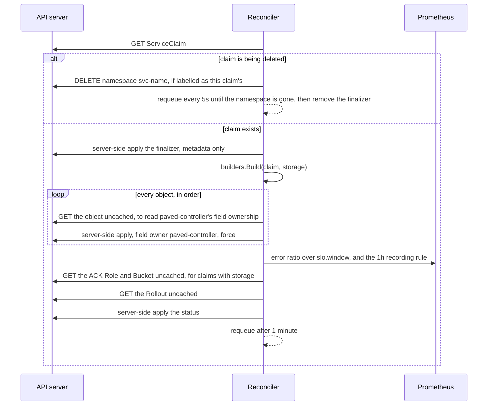
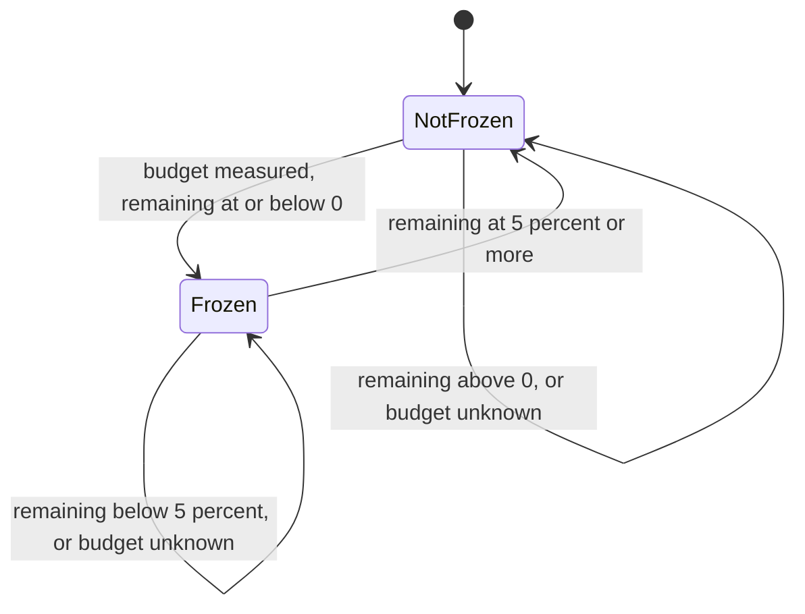
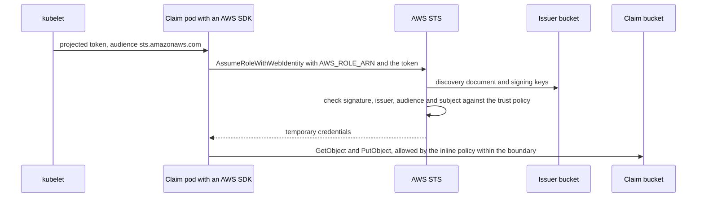

# Paved: low-level design

This document describes how each part of Paved works, down to the fields, algorithms and settings in
the code. Read the [high-level design](HLD.md) first for the parts and how they fit together.
Constants are quoted from the source. The worked numbers in section 7 come from the code's own
formulas, not from measurement.

## 1. Code map

| Path | Responsibility |
|---|---|
| `api/v1alpha1/serviceclaim_types.go` | `ServiceClaim` spec, status, condition types, validation markers |
| `cmd/main.go` | Manager setup: flags, scheme, AWS settings, cache, controller, webhook, probes |
| `internal/controller/serviceclaim_controller.go` | `Reconcile`, finalizer, status apply, watches and predicates |
| `internal/controller/apply.go`, `drift.go` | Turning typed objects into apply requests, and drift detection from field ownership |
| `internal/controller/slo_status.go` | Reading the error ratio and burn rate, and deciding `SLOHealthy` |
| `internal/controller/freeze.go` | The `DeploysFrozen` hysteresis, and `Ready` |
| `internal/controller/storage.go` | AWS settings from the environment, ACK CRD detection, `StorageReady` |
| `internal/builders/*.go` | One pure function per managed object, plus `Build` and `ManagedTypes` |
| `internal/slo/*.go` | Budget maths, recording rules, burn-rate alerts, Prometheus client |
| `internal/webhook/v1alpha1/serviceclaim_webhook.go` | The validating webhook |
| `config/` | Kubebuilder manifests: CRD, RBAC, manager, webhook, cert-manager |
| `deploy/` | What Argo CD applies: the app-of-apps, the operator overlay, the claims |
| `infra/aws/` | Terraform for the optional AWS link |
| `hack/` | `cluster-up.sh`, `demo-up.sh`, `aws-up.sh`, image scripts |
| `test/` | envtest suite, Kind e2e suite, third-party CRDs for tests |

## 2. API: `ServiceClaim` (`platform.paved.dev/v1alpha1`, namespaced)

### 2.1 Spec

| Field | Type | Validation and default |
|---|---|---|
| `owner` | string | Required, at least 1 character |
| `image` | string | Required, at least 1 character |
| `port` | int32 | 1 to 65535 |
| `tier` | string | `public`, `internal` or `batch` |
| `sli.type` | string | `http-availability` or `http-latency` |
| `sli.goodStatuses` | []int32 | Default `200, 201, 204, 301, 302, 304, 400, 404` |
| `sli.latencyThreshold` | string | Default `250ms` |
| `slo.objective` | string | Pattern `^[0-9]+(\.[0-9]+)?$`, and CEL `double(self) >= 90.0 && double(self) < 100.0` |
| `slo.window` | string | `7d`, `28d` or `30d`, default `28d` |
| `scale.min`, `scale.max` | int32 | Each at least 1 |
| `storage` | bool | Default `false`. CEL transition rule `self == oldSelf`: it can't change after creation. |

A root CEL rule adds: `!has(self.spec.storage) || !self.spec.storage || size(self.metadata.name) <= 48`.
The bucket name `paved-<name>-<8 hex digits>` must fit S3's 63 characters.

### 2.2 Status

`conditions`, `errorBudgetRemaining` (such as `62.5%`), `burnRate1h` (such as `14.40`),
`managedResources`, `observedGeneration`, `lastReconcileTime`, and `storage.bucket` and
`storage.roleARN`.

`kubectl get serviceclaims` shows Tier, Owner, Budget, Frozen, Ready and Age.

### 2.3 Conditions

| Type | Status and reason |
|---|---|
| `ResourcesSynced` | True `Applied`; False `ApplyFailed` or `InvalidSpec` |
| `SLOHealthy` | True `WithinBudget`; False `BudgetExhausted` or `FastBurn`; Unknown `NoTraffic`, `PrometheusUnavailable`, `UnusableData` or `InvalidSpec` |
| `DeploysFrozen` | True `BudgetExhausted`, `BudgetRecovering` or `BudgetUnknown`; False `WithinBudget` or `BudgetUnknown` |
| `StorageReady` (claims with storage only) | True `Provisioned`; False `Provisioning`, `ProvisioningFailed` or `StorageUnavailable`; Unknown `StorageUnreadable` |
| `Ready` | True `RolloutHealthy`. False with the reason of whichever gate failed first: the `ResourcesSynced` reason, the `StorageReady` reason, `RolloutNotFound`, `RolloutProgressing` or `RolloutDegraded`. Unknown with `RolloutUnreadable`, or when storage is unreadable. |

## 3. The manager (`cmd/main.go`)

Startup, in order:
1. **Flags.** `--metrics-bind-address` (`:8443` in the cluster, served over HTTPS behind authentication
   and authorisation filters), `--health-probe-bind-address=:8081`, `--leader-elect`,
   `--webhook-cert-path`, `--webhook-port=9443` and `--prometheus-url`. The last defaults to
   `http://kps-kube-prometheus-stack-prometheus.monitoring.svc:9090`. HTTP/2 is off unless
   `--enable-http2` is set.
2. **Scheme.** client-go, the ServiceClaim types, Argo Rollouts and prometheus-operator.
3. **AWS settings** (`storageForCluster`):
   - No `PAVED_AWS_*` variables: storage is off.
   - Only some variables set, or an invalid value: the manager exits.
   - All set, but the API server doesn't serve the ACK `Role` and `Bucket` kinds: storage is off, and
     the reason is logged.
   - Any other error from the API server makes the manager exit.
4. **Cache.** Every managed kind, plus the ACK kinds when storage is on, is cached only for objects
   labelled `app.kubernetes.io/managed-by=paved`. ServiceClaims are cached unfiltered.
5. **Manager.** Leader election ID `4ff88f17.paved.dev`.
6. **Controller.** A Prometheus client with a 5 s query timeout, the reconciler, and an uncached API
   reader for fresh reads.
7. **Webhook.** Registered unless `ENABLE_WEBHOOKS=false`, which `make run` sets because the
   certificate only exists in the cluster.
8. **Probes.** `/healthz` and `/readyz`.

The image is `gcr.io/distroless/static:nonroot` running as `65532:65532`. The Deployment loads
`PAVED_AWS_*` from the optional ConfigMap `paved-aws`.

## 4. Reconcile



Step by step:
1. **Get the claim.** If it's gone, stop. If it has a deletion timestamp, finalize it (section 11).
2. **Finalizer.** Add `paved.dev/finalizer` with a metadata-only server-side apply, so the controller
   never owns spec fields.
3. **Build.** `builders.Build(claim, storage)` returns the ordered object list.
   - If building fails, for example on an unparseable `latencyThreshold`:
     - `ResourcesSynced=False` (`InvalidSpec`)
     - `SLOHealthy=Unknown`
     - `Ready=False`
   - Nothing is applied, and the claim isn't requeued, because retrying can't help until the spec
     changes.
4. **Apply** every object in order, stopping at the first failure, since later objects live in the
   namespace applied first. Drift is reported only if the claim was already `ResourcesSynced=True` at
   its current generation (section 6).
5. **Evaluate** the SLO (section 7), the freeze (section 8) and, for claims with storage, `StorageReady`
   (section 12).
6. **Read the Rollout** through the uncached reader: a cached copy from before the apply could still
   report the previous generation as healthy. A `NotFound` here only means the cache hasn't caught up,
   and the Rollout watch will requeue the claim.
7. **Write the status** with a server-side apply built from scratch, so a field left out is cleared.
8. **Requeue** after `sloRefreshInterval` (1 minute). Reconcile returns an error, and so is retried
   with backoff, only when a write to the API server fails (the finalizer, an object or the status) or
   the Rollout read does.

### Watches

- **ServiceClaims.** Filtered by a predicate that admits only new generations, label or annotation
  changes, and deletions. Without it, the controller's own `lastReconcileTime` writes would requeue it
  forever
  ([ADR-010](../DECISIONS.md#adr-010-the-controllers-own-writes-never-retrigger-it-and-it-caches-only-platform-objects)).
- **Every managed kind, and the ACK kinds when storage is on.** Mapped back to their claim through the
  labels `paved.dev/claim` and `paved.dev/claim-namespace`. Owner references can't be used, because a
  claim and its children live in different namespaces.

## 5. Builders (`internal/builders`)

The functions are pure: no API calls, no clock and no randomness.

### 5.1 Labels

Every object carries:
- `app.kubernetes.io/name=<claim>`
- `app.kubernetes.io/managed-by=paved`
- `paved.dev/claim=<claim>`
- `paved.dev/claim-namespace=<claim namespace>`
- `paved.dev/owner=<owner>`

Selectors use only `app.kubernetes.io/name`, which never changes.

### 5.2 Objects per tier

| Object | public | internal | batch | Key settings |
|---|:-:|:-:|:-:|---|
| Namespace `svc-<name>` | ✓ | ✓ | ✓ | Labelled as the claim's; deleted with it |
| ServiceAccount `<name>` | ✓ | ✓ | ✓ | The pods' identity |
| ACK Role and Bucket (storage) | ✓ | ✓ | ✓ | Section 12 |
| AnalysisTemplate `<name>-canary` | ✓ | ✓ | | Section 9 |
| Rollout `<name>` | ✓ | ✓ | ✓ | Section 5.3 |
| NetworkPolicy `<name>` | ✓ | ✓ | ✓ | Section 5.4 |
| PrometheusRule `<name>` | ✓ | ✓ | ✓ | Groups `<name>.sli` (7 recording rules) and `<name>.slo-alerts` (4 alerts) |
| ServiceMonitor `<name>` | ✓ | ✓ | ✓ | Port `http`, path `/metrics`, every 30s. A batch claim's matches nothing. |
| ConfigMap `<name>-dashboard` | ✓ | ✓ | ✓ | Label `grafana_dashboard=1`. Panels: request rate, error ratio vs objective, latency p50/p95/p99, error budget remaining. UID `paved-` plus 16 hex digits of a SHA-256 hash. |
| ConfigMap `<name>-runbook` | ✓ | ✓ | ✓ | Key `runbook.md`: what the service is, who owns it, each alert with this claim's numbers, and the first three debugging steps |
| Service `<name>` | ✓ | ✓ | | ClusterIP, port 80 to the named port `http` |
| HorizontalPodAutoscaler `<name>` | ✓ | ✓ | | Targets the Rollout at 70% average CPU. `minReplicas` is the tier floor, and `maxReplicas` is `max(scale.max, floor)`. |
| PodDisruptionBudget `<name>` | ✓ | ✓ | | `maxUnavailable: 1` |
| Ingress `<name>` | ✓ | | | Class `traefik`, host `<name>.localhost`, path `/` (Prefix), no TLS |
| **Total** | **13** | **12** | **8** | 2 more with storage |

The tier floor (`MinReplicas`) is:
- public: `max(scale.min, 2)`
- internal: `scale.min`
- batch: 1

### 5.3 Rollout

- **Container** `app`, running `spec.image`, with the named port `http` on `spec.port`.
- **Security context.**
  - `runAsNonRoot`, UID 65532, seccomp `RuntimeDefault`
  - `allowPrivilegeEscalation: false`, read-only root filesystem, all capabilities dropped
- **Resources.** Requests 50m CPU and 64Mi memory; limits 250m CPU and 128Mi memory.
- **Probes** on port `http`, every 10 s, failure threshold 3:
  - readiness: `/readyz`
  - liveness: `/healthz`, after a 10 s initial delay
- **Strategy.** Canary steps `setWeight 20`, pause `2m`, `setWeight 50`, pause `2m`, `setWeight 100`.
  Split by replica count, with no traffic routing.
- **Analysis.** Public and internal claims run the `<name>-canary` template in the background, from
  step 1.
- **Replicas.** Left unset when an HPA exists, so the controller never reverts a scaling decision.
  Otherwise set to the tier floor.
- **Storage.** Claims with storage get the identity described in section 12.

### 5.4 NetworkPolicy

`policyTypes: [Ingress]` on every pod in the namespace. Egress is not restricted.

| From | Ports | Tiers |
|---|---|---|
| Namespace `monitoring` | The claim's port, TCP | All |
| Pods in the same namespace, and namespace `platform-system` | All | public, internal |
| Namespace `traefik` | The claim's port, TCP | public |

Namespaces are matched on `kubernetes.io/metadata.name`. The operator itself runs in `paved-system`,
which isn't in this list; this open item is recorded in PROGRESS.md.

## 6. Apply and drift detection (`apply.go`, `drift.go`)

For each object:
1. **Convert it** to unstructured, dropping the fields a typed object always serialises but Paved never
   sets: `metadata.creationTimestamp`, the pod template's `creationTimestamp`, and `status`. Otherwise
   Paved would own them.
2. **Read the live object** through the uncached reader. Keep Paved's managed-fields entry: manager
   `paved-controller`, operation `Apply`, no subresource. `NotFound` means the object doesn't exist.
3. **Server-side apply** with `client.ForceOwnership`. The response comes back into the same object.
4. **Compare** the entry before and after, both its `fieldsV1` bytes and its `time`:
   - The object didn't exist: a correction, `Recreated`.
   - The entry changed: a correction, `Reverted changes to`.
   - An apply that changes nothing leaves the entry byte-for-byte identical.

Corrections are logged, and recorded as `Normal` `DriftCorrected` Events on the claim, only when the
claim was already in sync at its current generation. A new claim or a spec edit is not drift
([ADR-015](../DECISIONS.md#adr-015-drift-is-detected-from-the-controllers-own-field-ownership)).

## 7. SLO engine (`internal/slo`, `slo_status.go`)

### 7.1 Budget maths

Budgets use exact rationals (`math/big`), so thresholds have no floating-point error:

```text
budget    = 1 - objective/100                  objective "99.5" -> 1/200 = 0.005
burnRate  = max(errorRatio, 0) / budget
consumed  = burnRate over the SLO window
remaining = clamp(1 - consumed, 0, 1)
```

A zero budget, or an error ratio that is NaN or infinite, is an error rather than a division. Status
shows `remaining` with one decimal place (`62.5%`) and the burn rate with two (`14.40`).

### 7.2 Recording rules

For each window in `5m, 30m, 1h, 2h, 6h, 1d, 3d`, the record is
`sli:<type with _ for ->:error_ratio_rate<window>`, labelled `service`, `owner` and `tier`.

`http-availability`:

```text
(sum(rate(http_requests_total{namespace="svc-<name>",code!~"<good statuses joined by |>"}[<window>])) or vector(0))
/
sum(rate(http_requests_total{namespace="svc-<name>"}[<window>]))
```

`http-latency`:

```text
1 - (
  sum(rate(http_request_duration_seconds_bucket{namespace="svc-<name>",le="<threshold in seconds>"}[<window>]))
  /
  sum(rate(http_request_duration_seconds_count{namespace="svc-<name>"}[<window>]))
)
```

`le` is formatted the way Prometheus 3 stores bucket bounds, so whole seconds read `1.0`. With no
requests in a window, the result is empty or NaN: nothing is recorded, and no alert can fire.

### 7.3 Burn-rate alerts

All four alerts are named `SLOErrorBudgetBurn`, have no `for` clause, and fire while:

```text
sli:<type>:error_ratio_rate<long>{service="<name>"} > threshold
and
sli:<type>:error_ratio_rate<short>{service="<name>"} > threshold
```

Here `threshold = burnRate × budget`, as an exact decimal.

| Severity | Burn rate | Long window | Short window | Threshold at 99.5% | Budget lifetime at 28d |
|---|---|---|---|---|---|
| page | 14.4 | 1h | 5m | 0.072 | about 47 hours |
| page | 6 | 6h | 30m | 0.03 | about 4.7 days |
| ticket | 3 | 1d | 2h | 0.015 | about 9.3 days |
| ticket | 1 | 3d | 6h | 0.005 | about 28 days |

The last two columns are computed by `Threshold` and `BudgetLifetime` for objective `99.5` and window
`28d`. Each alert is labelled `severity`, `long_window`, `short_window`, `service`, `owner` and `tier`.
Its annotations are `summary`, `description`, `owner`, `runbook_url` (`docs/runbooks/slo-burn-rate.md`)
and `runbook` (`svc-<name>/<name>-runbook`).

### 7.4 Evaluating a claim

Every reconcile issues two instant queries, each with a 5 s timeout:
- **window ratio:** the error-ratio expression above, over `slo.window` (for example 28d), read raw
  rather than from a recording rule
- **hour ratio:** `sli:<type>:error_ratio_rate1h{service="<name>"}`

An empty result or NaN is `ErrNoData`. They are evaluated in this order:

| Case | `SLOHealthy` |
|---|---|
| No Prometheus client | Unknown `PrometheusUnavailable` |
| The objective or SLI can't be turned into a query | Unknown `InvalidSpec` |
| A query error other than no data | Unknown `PrometheusUnavailable` (fail open) |
| No data over the window | Unknown `NoTraffic`, budget blank |
| A ratio the budget maths rejects, such as an infinite one | Unknown `UnusableData` |
| `remaining <= 0` | False `BudgetExhausted` |
| Hour data and `burnRate1h >= 14.4` | False `FastBurn` |
| Otherwise | True `WithinBudget` |

`FastBurn` alone doesn't freeze deploys.

## 8. Deploy freeze (`freeze.go`)



`freezeCondition` evaluates these cases in order, given whether the claim was frozen before:

| Case | `DeploysFrozen` |
|---|---|
| Budget not measured, and was frozen | True `BudgetUnknown`: the last decision stands |
| Budget not measured | False `BudgetUnknown` |
| `remaining <= 0` | True `BudgetExhausted` |
| Was frozen and `remaining < 0.05` | True `BudgetRecovering` |
| Otherwise | False `WithinBudget` |

`UnfreezeBudget = 0.05`
([ADR-017](../DECISIONS.md#adr-017-deploys-freeze-when-the-budget-is-gone-and-unfreeze-only-at-5)).

## 9. Canary analysis (`analysistemplate.go`)

The analysis has one metric, `sli-error-ratio`:
- **Provider:** Prometheus at the default in-cluster URL.
- **Query:** `sli:<type>:error_ratio_rate5m{service="<name>"}`.
- **Interval:** `30s`.
- **Failure condition:** `len(result) > 0 && result[0] > 0.05`, with `failureLimit: 0`. The first
  failed measurement aborts the rollout. An empty result, from a service with no traffic, doesn't fail
  it.

Batch claims have no analysis.

## 10. Admission webhook (`internal/webhook/v1alpha1`)

### Registration

- Path `/validate-platform-paved-dev-v1alpha1-serviceclaim`, name `vserviceclaim-v1alpha1.paved.dev`.
- `CREATE` and `UPDATE` on `serviceclaims`.
- `failurePolicy: Fail`, `sideEffects: NoneOnDryRun`.
- It serves on port 9443 with the certificate from the `webhook-server-cert` Secret, which
  cert-manager issues. cert-manager also injects the CA into the configuration, and Argo CD ignores
  `caBundle` differences.

### What it admits

- **Creates and deletes** always.
- **Updates** are rejected only when all three hold:
  - the stored claim's `DeploysFrozen` is True
  - `spec.image` changes
  - the update doesn't set a break-glass reason

A break-glass reason counts only when all of these hold:
- `paved.dev/break-glass` is non-blank after trimming.
- Its value differs from the stored claim's, so it was added or changed in this very update. A reason
  left over from an earlier emergency can't carry a later change through.
- The admission request can be read, so the actor is known. Otherwise the change is rejected.

### Its responses

The rejection is a plain error, so the API server returns 403:

```text
deploys frozen: <name> has <budget> error budget remaining in a <window> window (burn rate <n.n>x). Override with annotation paved.dev/break-glass="<reason>" — this is audited.
```

A break-glass change is admitted with a warning. Unless it is a dry run, it also records a `Warning`
`BreakGlassUsed` Event from `paved-webhook`, with the note
`<user> changed the image from <old> to <new> during a deploy freeze: <reason>`, truncated to
1024 bytes without splitting a character.

## 11. Ready and deletion

### `readyCondition`

The first gate that fails decides the condition:
1. `ResourcesSynced` isn't True: False, with its reason.
2. The claim has storage and `StorageReady` isn't True: False, or Unknown when storage is unreadable,
   with the storage reason.
3. The Rollout isn't found (`RolloutNotFound`), or can't be read (Unknown `RolloutUnreadable`).
4. Argo Rollouts hasn't observed the current generation: `RolloutProgressing`.
5. The phase is `Healthy`: True `RolloutHealthy`. `Degraded`: False `RolloutDegraded`. Anything else:
   `RolloutProgressing`.

### Finalization

For a claim with a deletion timestamp and Paved's finalizer:
- **Namespace gone:** remove the finalizer.
- **Namespace labelled as another claim's:** leave it, and remove the finalizer.
- **Otherwise:** delete the namespace if it isn't already terminating, and requeue every 5 s.

ACK objects inside the namespace keep it terminating until ACK has deleted the IAM role; the bucket is
retained.

## 12. Storage (optional)

### 12.1 Settings

| Variable | Meaning |
|---|---|
| `PAVED_AWS_ACCOUNT_ID` | 12 digits |
| `PAVED_AWS_REGION` | Lower-case letters, digits and hyphens |
| `PAVED_AWS_OIDC_ISSUER` | The issuer host and path, with no scheme or trailing slash |
| `PAVED_AWS_PERMISSIONS_BOUNDARY_ARN` | Must start `arn:aws:iam::<account>:policy/` |

`hack/cluster-up.sh` writes these to `paved-system/paved-aws` from the Terraform outputs.

### 12.2 Objects

Both objects are applied in `svc-<name>`, named `<name>`.

**ACK `Role`** (`iam.services.k8s.aws/v1alpha1`), annotated `services.k8s.aws/adoption-policy: adopt-or-create`:
- `name: paved-<name>`, `path: /paved/workloads/`, `maxSessionDuration: 3600`.
- `permissionsBoundary`: the configured boundary ARN.
- `assumeRolePolicyDocument`:
  - Allow `sts:AssumeRoleWithWebIdentity` for `Federated: arn:aws:iam::<account>:oidc-provider/<issuer>`.
  - `StringEquals` `<issuer>:aud = sts.amazonaws.com` and
    `<issuer>:sub = system:serviceaccount:svc-<name>:<name>`.
- `inlinePolicies.bucket-access`:
  - Allow `s3:GetBucketLocation` and `s3:ListBucket` on the bucket.
  - Allow `s3:DeleteObject`, `s3:GetObject` and `s3:PutObject` on `<bucket>/*`.
- Tags `paved.dev/claim` and `paved.dev/claim-namespace`.

**ACK `Bucket`** (`s3.services.k8s.aws/v1alpha1`), annotated `adopt-or-create` and
`services.k8s.aws/deletion-policy: retain`:
- `name: paved-<name>-<first 8 hex digits of sha256(account/region/claim namespace/claim name)>`.
- `publicAccessBlock`: all four settings true.
- `createBucketConfiguration.locationConstraint` set to the region, except in `us-east-1`.
- The same two tags.

**Pod identity**, added to the Rollout:
- A projected volume `aws-token`: a service-account token with audience `sts.amazonaws.com`, expiring
  after 3600 s, at path `token`.
- Mounted read-only at `/var/run/secrets/paved.dev/aws`.
- The environment:
  - `AWS_ROLE_ARN`
  - `AWS_WEB_IDENTITY_TOKEN_FILE`
  - `AWS_REGION` and `AWS_DEFAULT_REGION`
  - `PAVED_STORAGE_BUCKET`

The role ARN is computed, so the Rollout doesn't wait for ACK.

### 12.3 `StorageReady`

The controller reads the Role, then the Bucket, through the uncached reader, and ACK's conditions
(`ACK.ResourceSynced`, `ACK.Terminal`, `ACK.Recoverable`) from each:

| Observation | `StorageReady` |
|---|---|
| The cluster isn't linked to AWS | False `StorageUnavailable` |
| An object is `NotFound` | False `Provisioning` ("The ACK <kind> does not exist yet") |
| A read error, or a malformed status | Unknown `StorageUnreadable` |
| `ACK.Terminal=True` | False `ProvisioningFailed`, with ACK's message |
| `ACK.ResourceSynced` isn't True | False `Provisioning`, with ACK's recoverable message if there is one |
| Both synced | True `Provisioned` |

### 12.4 Token flow



### 12.5 AWS side (`infra/aws`, hashicorp/aws 6.64.0)

- **The issuer bucket** `paved-oidc-<first 12 hex digits of sha256(account/region)>`:
  - ACLs are blocked, and only a bucket policy grants public `s3:GetObject`, on
    `.well-known/openid-configuration` and `openid/v1/jwks`.
  - Placeholder documents come first: IAM validates the discovery document when it creates the
    provider. `ignore_changes` keeps Terraform from reverting cluster-up's replacements.
- **An IAM OIDC provider** for `https://<issuer bucket>.s3.<region>.amazonaws.com`, client ID
  `sts.amazonaws.com`, with no thumbprint.
- **The boundary** `/paved/paved-workload-boundary`:
  - Allow object reads, writes and deletes, and listing, on `paved-*` buckets.
  - Deny everything on the issuer bucket.
- **Role `/paved/controllers/paved-ack-iam-controller`,** trusted only by
  `system:serviceaccount:ack-system:ack-iam-controller`:
  - `CreateRole` and `PutRolePermissionsBoundary` on `/paved/workloads/*`, only with the boundary.
  - Manage roles, their tags and inline policies under `/paved/workloads/*`.
  - `GetRole` on `role/paved-*`: IAM checks a lookup of a role that doesn't exist yet against its
    name, without the path.
  - Deny `DeleteRolePermissionsBoundary`, and everything on `/paved/controllers/*`.
- **Role `/paved/controllers/paved-ack-s3-controller`,** trusted only by
  `system:serviceaccount:ack-system:ack-s3-controller`:
  - `CreateBucket`, `DeleteBucket`, `Get*`, `List*`, `Put*`, `TagResource` and `UntagResource` on
    `paved-*`.
  - `ListAllMyBuckets`.
  - Deny object data, and everything on the issuer bucket.

### 12.6 Bootstrap (`hack/cluster-up.sh` with `PAVED_AWS_PROFILE`)

1. `hack/aws-up.sh`: refuse a profile that stores an access key, check the session, and run
   `terraform apply`.
2. Create the cluster with `--kube-apiserver-arg=service-account-issuer=https://<issuer>` and
   `service-account-jwks-uri=https://<issuer>/openid/v1/jwks`. The issuer can only be set at creation,
   so an existing cluster with a different issuer is refused.
3. Publish the cluster's discovery document and keys to the bucket, and read the keys back
   anonymously over HTTPS.
4. Install the platform stack, then the ACK IAM and S3 charts. Their values add `AWS_ROLE_ARN`,
   `AWS_WEB_IDENTITY_TOKEN_FILE` and the same projected token volume.
5. Write `paved-aws`, and restart Paved if it is already running.

## 13. Delivery

### Argo CD

- **`paved`**, the root app, syncs `deploy/argocd/apps` with automated prune and self-heal.
- **`paved-operator`**, sync wave 0:
  - It syncs `deploy/operator`, which is `config/default` with the GHCR image tag, into `paved-system`.
  - It uses server-side apply, `RespectIgnoreDifferences` for the webhook `caBundle`, and up to 10
    retries backing off from 10 s to 3 minutes.
- **`platform-claims`**, sync wave 1, syncs `deploy/claims` into `platform-claims` with server-side
  apply and the same retries.

### CI (GitHub Actions, on every push and pull request)

- **CI:**
  1. `go vet`
  2. unit tests
  3. `services/shortlink` tests
  4. envtest
  5. image build
  6. a Trivy scan that fails on fixable HIGH or CRITICAL findings
  7. on pushes to `main` only, a push to GHCR
- **Lint:** golangci-lint, with the logcheck plugin.
- **E2E Tests:** a Kind cluster, with `test/crds` applied.

Every action is pinned by commit SHA.

## 14. RBAC

The generated `manager-role` grants:
- `serviceclaims`: full access, plus the `status` and `finalizers` subresources.
- Core `namespaces`, `serviceaccounts`, `services` and `configmaps`.
- `networkpolicies` and `ingresses`; `horizontalpodautoscalers`; `poddisruptionbudgets`.
- Argo `rollouts` and `analysistemplates`.
- `servicemonitors` and `prometheusrules`.
- ACK `roles` and `buckets`.
- `events.k8s.io` events: create and patch.

The managed kinds are all get, list, watch, create, update, patch and delete.

## 15. Testing

| Layer | What it covers |
|---|---|
| Unit tests (`internal/builders`, `internal/slo`, `internal/controller`, webhook, both services) | Every builder's output, the budget maths and PromQL, drift comparison, freeze and Ready tables, storage settings and ACK condition parsing, the webhook's decisions |
| envtest, controller suite | 11 specs |
| envtest, webhook suite | 12 specs |
| envtest, `test/` | 8 specs, with the real reconciler in a manager: object counts, drift recreation, idempotency, cascade, `observedGeneration`, the storage Role and Bucket, and the CEL rules |
| Kind e2e | The operator deployed into a Kind cluster, in CI |
| Demos | Live acceptance on the real stack: drift, freeze, onboarding, canary abort, storage |

That is 123 in total, all passing: 92 Go tests and 31 Ginkgo specs.

## 16. Failure modes

| Failure | Behaviour |
|---|---|
| Prometheus unreachable, or a query timing out after 5 s | `SLOHealthy=Unknown`, a freeze already in place stays, resources are still reconciled |
| A service with no traffic | `NoTraffic`, budget blank, no alerts, and a canary analysis doesn't fail |
| The webhook is down | Claim creates and updates are refused (`failurePolicy: Fail`) |
| An object fails to apply | `ResourcesSynced=False`, later objects skipped, the error returned and retried with backoff |
| AWS settings incomplete or invalid | The manager exits at startup |
| AWS settings present but ACK CRDs missing | Storage off; claims with storage report `StorageUnavailable` |
| ACK gets `AccessDenied` | `StorageReady=False` `Provisioning`, with ACK's message; `Ready=False` |
| The controller loses its lease | It exits and restarts; another reconcile catches up (seen once on Day 8, under memory pressure) |
| A claim is deleted while ACK is unavailable | Its namespace stays terminating until ACK removes the Role's finalizer |
